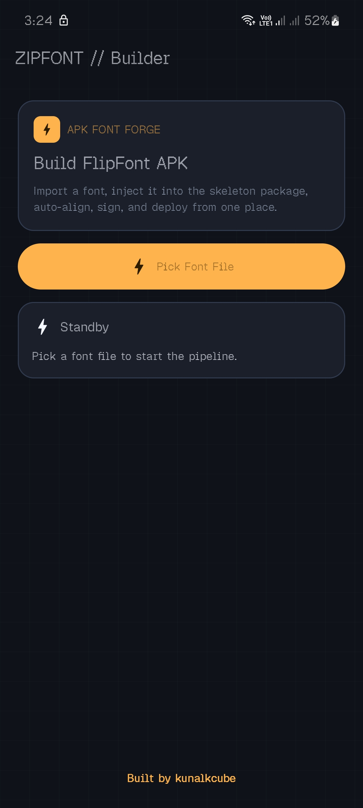
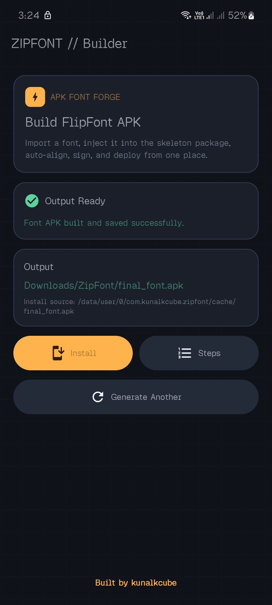
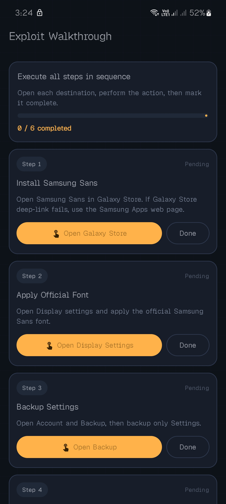

# ZipFont

ZipFont is an Android app that generates a FlipFont APK from a selected custom font file.

  
  
  

## Features

- Pick a custom font file (.ttf/.otf)
- Inject font into FlipFont skeleton APK
- Align and sign generated APK
- Save output to Downloads/ZipFont
- In-app install flow and guided steps screen

## Tech Stack

- Kotlin
- Jetpack Compose
- Android SDK tools (zipalign/apksig via library flow)

## Build

Debug build:

    ./gradlew :app:assembleDebug

Release build (PowerShell):

    $env:RELEASE_STORE_FILE="release.jks"
    $env:RELEASE_STORE_PASSWORD="your_store_password"
    $env:RELEASE_KEY_ALIAS="release"
    $env:RELEASE_KEY_PASSWORD="your_key_password"
    ./gradlew :app:assembleRelease

## Output

Generated font APK is saved to:

    Downloads/ZipFont/final_font.apk

---
Built by [kunalkcube](https://github.com/kunalkcube)
